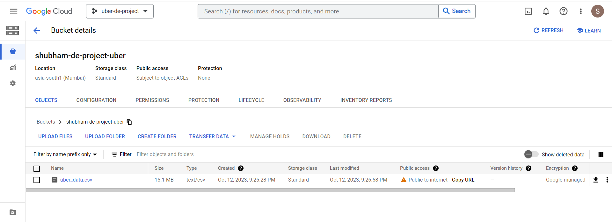

# Uber Analytics | Data Engineering GCP Project

## Introduction

The goal of this project is to perform data analytics on Uber data using various tools and technologies, including Python, GCP Storage, Compute Instance, Mage Data Pipeline Tool, BigQuery, and Looker Studio.


## Architecture 


## Dataset Used
TLC Trip Record Data
Yellow and green taxi trip records include fields capturing pick-up and drop-off dates/times, pick-up and drop-off locations, trip distances, itemized fares, rate types, payment types, and driver-reported passenger counts. 

Dataset used - https://github.com/shubhammirajkar/uber_etl_data_engineering_project/blob/main/uber_data.csv

More information about dataset can be found here:
1. Website - https://www.nyc.gov/site/tlc/about/tlc-trip-record-data.page
2. Data Dictionary - https://www.nyc.gov/assets/tlc/downloads/pdf/data_dictionary_trip_records_yellow.pdf

## Workflow 
### 1. Loading the Dataset

First, a GCS Bucket is created, then the [dataset](https://github.com/shubhammirajkar/uber_etl_data_engineering_project/blob/main/uber_data.csv) is loaded in Bucket.




### 2. Building Dimensional Model

After setting up the Data source, a Data Model is built.

Here's the Data Model Overview:


## 3. Setting up Mage on VM Instance and populating BigQuery Tables

Further, on VM Instance, Mage is set up and the following scripts are used for Data Loader, Transformer, and Data Exporter respectively:

[extract.py](https://github.com/shubhammirajkar/uber_etl_data_engineering_project/blob/main/mage-files/extract.py)

[transform.py](https://github.com/shubhammirajkar/uber_etl_data_engineering_project/blob/main/mage-files/transform.py)

[load.py](https://github.com/shubhammirajkar/uber_etl_data_engineering_project/blob/main/mage-files/load.py)

Here's the Mage UI's overview:


Next, the ETL Process is triggered and Data is Exported into Bigquery Tables.

The following Query is Executed in BigQuery Console to create a table for further analysis:


```
CREATE OR REPLACE TABLE `uber-de-project-401815.uber_data_engineering.tbl_analytics` AS (
SELECT 
f.VendorID,
d.tpep_pickup_datetime,
d.tpep_dropoff_datetime,
p.passenger_count,
t.trip_distance,
r.rate_code_name,
pick.pickup_latitude,
pick.pickup_longitude,
drop.dropoff_latitude,
drop.dropoff_longitude,
pay.payment_type_name,
f.fare_amount,
f.extra,
f.mta_tax,
f.tip_amount,
f.tolls_amount,
f.improvement_surcharge,
f.total_amount
FROM 

`uber-de-project-401815.uber_data_engineering.fact_table` f
JOIN `uber-de-project-401815.uber_data_engineering.datetime_dim` d  ON f.datetime_id=d.datetime_id
JOIN `uber-de-project-401815.uber_data_engineering.passenger_count_dim` p  ON p.passenger_count_id=f.passenger_count_id  
JOIN `uber-de-project-401815.uber_data_engineering.trip_distance_dim` t  ON t.trip_distance_id=f.trip_distance_id  
JOIN `uber-de-project-401815.uber_data_engineering.rate_code_dim` r ON r.rate_code_id=f.rate_code_id  
JOIN `uber-de-project-401815.uber_data_engineering.pickup_location_dim` pick ON pick.pickup_location_id=f.pickup_location_id
JOIN `uber-de-project-401815.uber_data_engineering.dropoff_location_dim` drop ON drop.dropoff_location_id=f.dropoff_location_id
JOIN `uber-de-project-401815.uber_data_engineering.payment_type_dim` pay ON pay.payment_type_id=f.payment_type_id)
;
```


### 4. Creating a Dashboard with Looker Studio

Next, a Dashboard is created by using the BigQuery analytics table created in the previous step:


